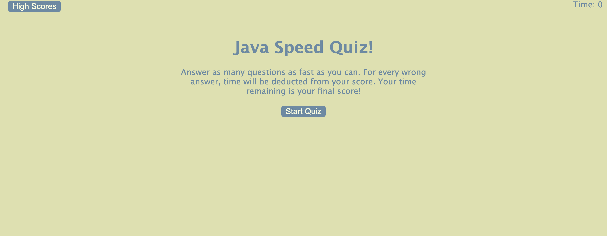

# Code-Quiz
### Challenge 4

## Live Deployment Link
[Code Quiz](https://vincenttoon.github.io/java-quiz-lord/)

## Instructions for Challenge

Use combined knowledge of HTML, CSS and JS to create a functional website that the user can navigate. The primary function of the website is to send the user through a JS based quiz that scores them based on questions right + time remaining. The website stores scores in local storage to collect high scores!

## Deployment Team

[Vincent Toon](https://github.com/Vincenttoon)

## User Story
- AS A coding boot camp student
- I WANT to take a timed quiz on JavaScript fundamentals that stores high scores
- SO THAT I can gauge my progress compared to my peers

### Acceptance Criteria
- GIVEN I am taking a code quiz
- WHEN I click the start button
- THEN a timer starts and I am presented with a question
- WHEN I answer a question
- THEN I am presented with another question
- WHEN I answer a question incorrectly
- THEN time is subtracted from the clock
- WHEN all questions are answered or the timer reaches 0
- THEN the game is over
- WHEN the game is over
- THEN I can save my initials and score